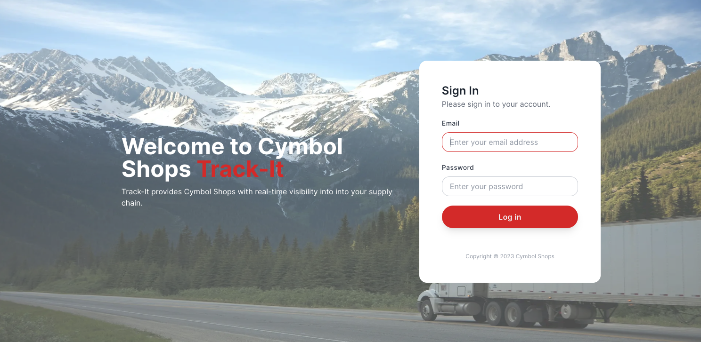
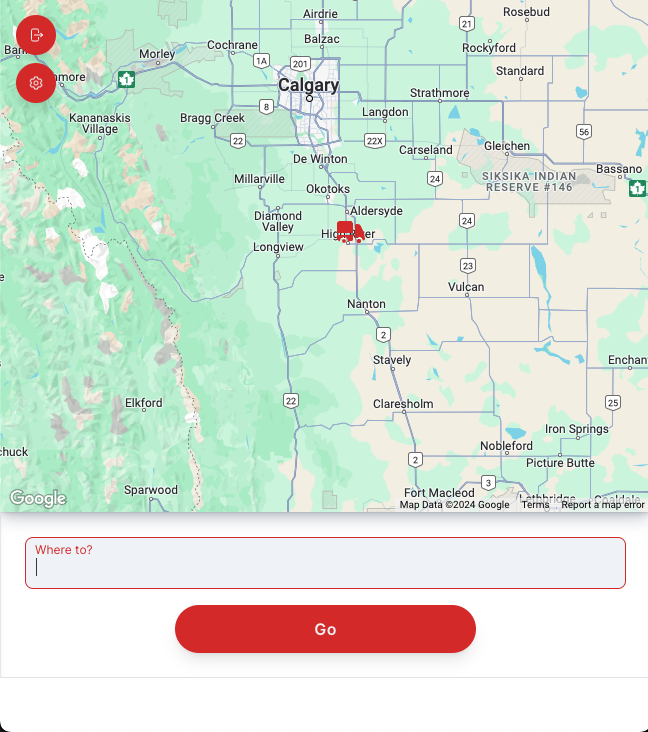
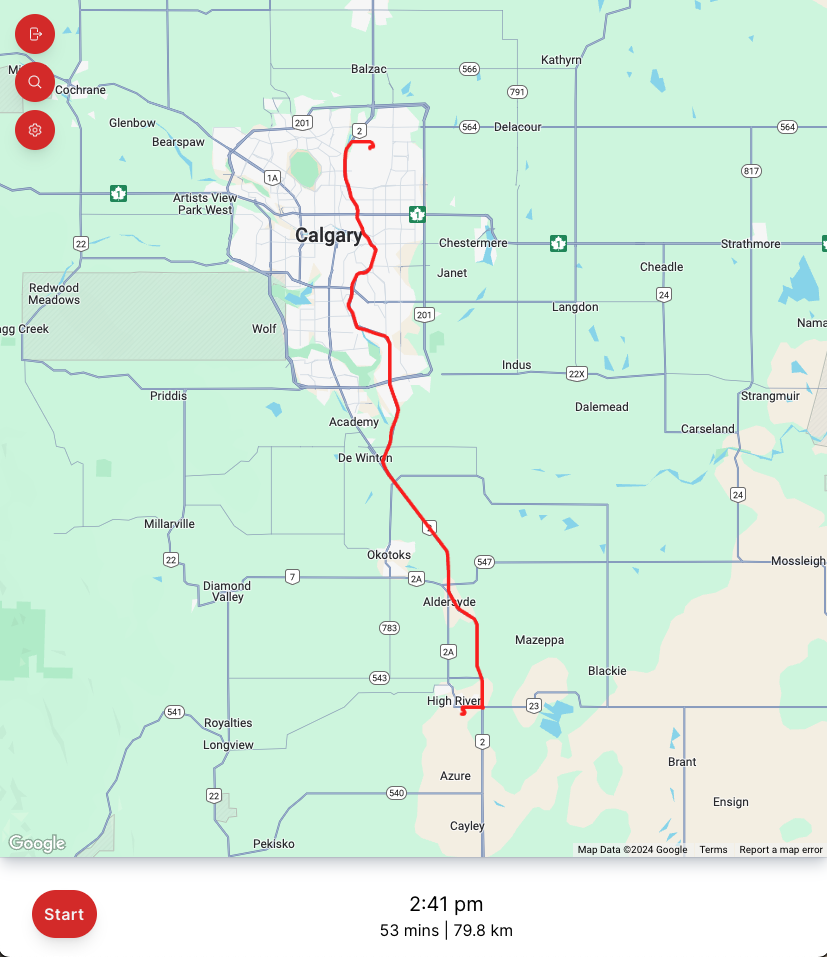
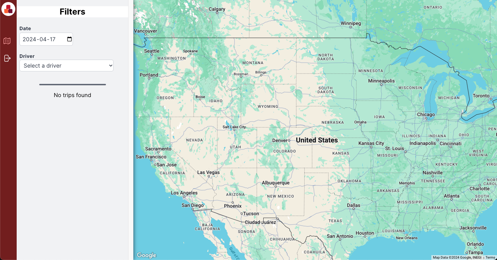

# Google Maps Platform - Supply Chain Client

The Supply Chain Truck Tracking Mobile Webpage is a tool designed to provide real-time visibility into the location and status of trucks transporting goods within a supply chain network to a distribution center or store location. This information is crucial for supply chain managers to make informed decisions about yard operations and distribution centers  for scheduling deliveries, unloading & yard time optimization. 

Traditional methods of truck tracking, such as phone calls and email updates, are inefficient and time-consuming. They often provide outdated information and lack real-time visibility into the movement of goods.

The Supply Chain Truck Tracking Mobile Webpage provides a centralized platform for managing and tracking truck movements. It utilizes HTML5 Geolocation technology to provide real-time updates on truck locations, allowing users to monitor their progress and identify any potential delays or exceptions.

## Roadmap

### Path to V1

- [x] User Credentials / login for tracking drivers

- [x] Search for the destination Warehouse

- [x] Track Truck Location
- [x] Generate ETA to destination
- [x] Interactive map with truck location markers
- [x] Single Route visualization

- [x] Admin section for searching for completed deliveries

- [] Mock Data w/ management

## Google Cloud Setup
### This is incomplete, I will update this in more details later.

You will need a number of Google Cloud services:

- Identity Platform
- Firestore
- Secrets Manager
- GMP Javascript API
- GMP Routes API - Directions & Distance Matrix
- GMP Places Autocomplete API

For Production
- Cloud Build
- Cloud Deploy
- Artifact Registry
- Cloud Run

1. Create a new Google Cloud Project and enable the above APIs
2. In Identity Platform, add the Email / Passsword provider
  - Take note of the Application Setup details (apiKey and AuthDomain)
3. Create a couple of users, one user must have the prefix admin_ in order to get access to the admin page
4. Create a firestore (default) database
5. From the Firebase console grab the apiKey, App ID, authDomain, Firebase Service Account)
6. Create a Google Maps API Key that is restrictred the above GMP APIs. Take note of the API Key
7. In Google Maps Console, create a new map in Map Styles and create a new map ID. Take note of the map ID
8. In Secrets Manager, you need to create the following secrets:
  - FIREBASE_API_KEY
  - FIREBASE_APP_ID
  - FIREBASE_AUTH_DOMAINS
  - FIREBASE_SA
  - MAPS_API_KEY
  - MAPS_MAP_ID

## Run Locally

1. Make sure you have NPM and Node installed in your local environment
2. Run `npm i`
3. Rename the sample environment file `mv .env.sample .env.local`
4. Edit the .env.local file to match your environment
5. Run `npm run dev`

## Deploy to Cloud Run

1. Run `gcloud builds submit --project PROJECT_ID --region REGION --substitutions=_LOCATION=REGION,_REPOSITORY=ARTIFACT_REGISTRY_NAME`. * Change RROJECT_ID, REGION and ARTIFACT_REGISTRY_NAME to match your environment.
